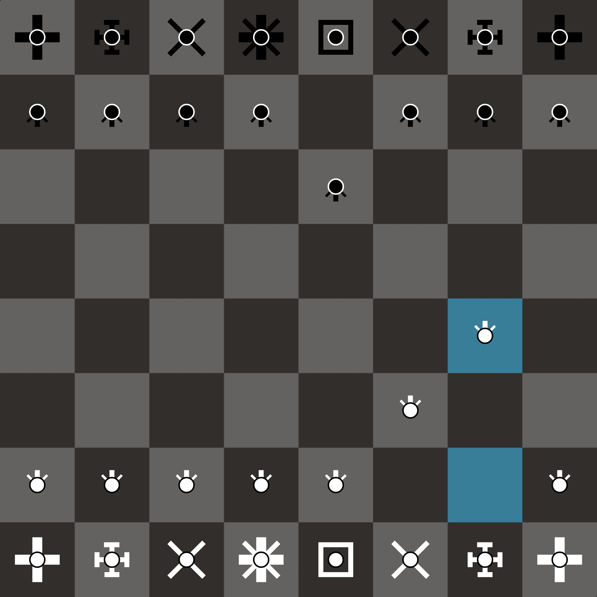

# abstract-chess-notation

This is an unofficial minimalist CSS userstyle for [chess.com](https://chess.com) chess pieces that makes sense - no "kings" and "queens" and "horses" and all of that human symbolism bs.

Chess pieces are just mathematical entities with a defined set of finite rules, so I just made a meaningful notation - for our ape brains anyway, only on the IM level and above do (some) humans kind of ascend and can play the game entirely in their head with no need for dumb interfaces, although they sadly still need _some_ form of communication to exchange thhe moves with their opponent.

Ok, I like minimalism and dislike symbolism, but the final version turned out to be kind of an eye bleach - I guess my ape brain is too wired to those human symbols, although I have this style set and I almost returned to my level of 800 elo play I had before I made this.

## Installation
If you haven't already, install Stylus ([chrome](https://chrome.google.com/webstore/detail/stylus/clngdbkpkpeebahjckkjfobafhncgmne), [firefox](https://addons.mozilla.org/en-US/firefox/addon/styl-us/), [opera](https://addons.opera.com/en/extensions/details/stylus/)) - it is a popular browser extension for custom userstyles, and a secure one (unlike Stylish).

Then you can install the userstyle with [this](https://raw.githubusercontent.com/necauqua/abstract-chess-notation/main/style.user.css) - it will open the extension page prompting you to install the style.

In the 'list of installed styles' menu of the browser extension you can press a cogweel icon on this style to configure the promotion menu background colors - I changed (shades of purple by default) because default white color completely blends the white pieces.

## Explanation
This thing is one file that contains a set of CSS (style) rules that replaces whatever image chess pieces use with SVG images that are inlined directly in those rules in form of text - SVG is a text format (describes shapes and colors) and there it this thing called "data URLs" where the data of the that the URL 'points to' is actually within the URL itself.

So those rules replace whatever URLs [chess.com](https://chess.com) uses for the chess pieces with data URLs containing (slightly, to allow special characters) encoded SVG descriptions of how I want them to look like, thats it.

Its just a tiny bit more complicated than I've just described - I also use a thing called 'CSS pseudoelements' to allow piece rotation, so I am not exactly 'replacing the URLs' in case you know what I am talking about and/or can read the CSS.

And then this file gets loaded into the site by a popular browser extension for custom userstyles, thats it.
